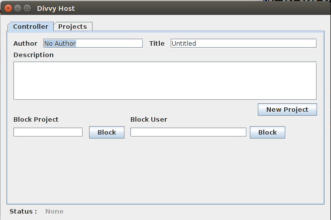
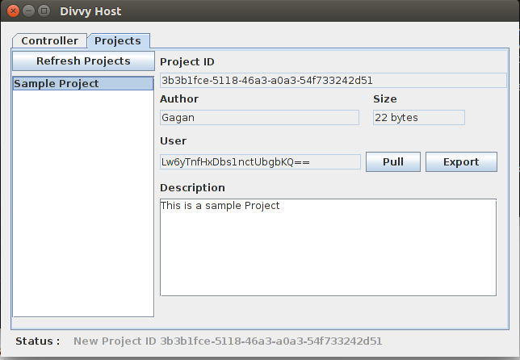
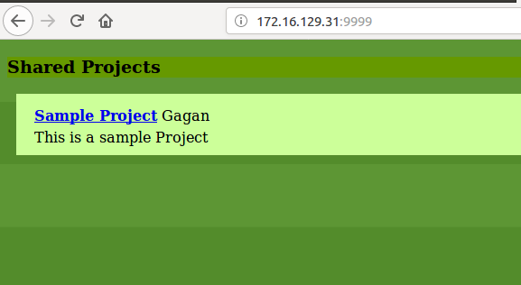

# DivvyHost
Decentralized Hosting : Fully P2P Hosting 

[](https://travis-ci.org/scopeInfinity/DivvyHost)


The Project aims for decentralized Hosting instead of a normal static IP or nameserver based Web Hosting.

Any user can use DivvyHost to upload his HTML website over a intranet and only he can modify it later on.

Divvy Client Spreaded Over Intranet having a intranet IP, finds other DivvyClient shares website content which it contains with other, leading to spread of latest data all over intranet. Those HTML website uploaded from any user availabe to everyone even if few of client is down/off/terminated.


## Dependencies

  * Java 1.7 or higher
  
  * Ant 1.8.0 or higher (Compiling)

  * Python 2 (Hosting)  

## Compile
    cd /path/to/DivvyHost/
    ant compile

## Distribution
  Distribution Directory `/path/to/DivvyHost/dist`
  
    cd /path/to/DivvyHost/
    ant jar
    
## Executing
  
    cd /path/to/DivvyDistribution/
    java -jar DivvyHost.jar
    
  
  __Without GUI__
  
    cd /path/to/DivvyDistribution/
    java -jar DivvyHost.jar -nogui

  __Using Bash Script__

   Service Options are for controlling program in background
   
   Default Logs Path `/tmp/divvy.log`

     Usage: bin.sh <option> [DivvyHost.jar]
       
     Options:
      -help    Help
      -run   Run With GUI
      -nogui   Run Without GUI
      -test    Check Any Running Instance
      -show    Show GUI
      -hide    Hide GUI

    Service Options:
     start    Start DivvyHost
     stop   Stop DivvyHost
     reload   Reload DivvyHost
  
  Example
  
    cd /path/to/DivvyDistribution/
    bash bin.sh -run

### Usage

- DivvyHost is supposed to be started at boottime. To manually start the service use 
```
divvy start
```

- To make UI visible at any point time
```
divvy  -show
```

- Create new project
   - 

- Project List
   - 

- Update Project Content
   - Goto `/path/to/divvy/Hosted/3b3b1fce-5118-46a3-a0a3-54f733242d51` (For ex. `~/Divvy/Hosted/3b3b1fce-5118-46a3-a0a3-54f733242d51`)
   - Host HTML website in current directory
   - From UI, select the project and `PULL` it.

- Web Hosting
   - Goto 'http://mydivvyserverip:9999' and see website hosted.
   - 
   
- Project List with keep on syncing with other divvyhost server within the network.
- Configurations can be edited from `/path/to/divvy/Conf/conf.properties`
```
#Sample Divvy Host Configuration
#Tue Mar 13 15:12:31 IST 2018
MAX_SIZE_ON_DISK_MB=200
INTERNAL_IP=172.16.156.0/24,127.0.0.1/31
```


  
    
  
